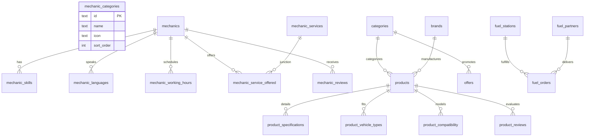

# TASK PHASE 1 — TASK 1: PRODUCTION PILOT CATALOG SEEDING
## STEP 0 — RECONNAISSANCE REPORT

> **Executive Authority:** Senior Staff Engineer / Technical Architect  
> **Target Environment:** Supabase PostgreSQL (`aws-0-ap-northeast-2.pooler.supabase.com:5432/postgres`)  
> **Status:** STEP 0 — RECONNAISSANCE ONLY (READ-ONLY AUDIT)  
> **Database Modifications Performed:** NONE  
> **Code Modifications Performed:** NONE  

---

### 1. Executive Summary

Mecha Connect's backend and mobile application architectures are functionally mature: 700/700 backend pytest tests and 238/238 Flutter tests are passing, and user authentication, profile, wallet, unified orders, and drawer navigation have been manually verified on an Android emulator (`emulator-5554`).

However, the application faces a critical product-level blocker: **the live Supabase database catalog tables are completely empty (0 rows)** across the three primary commerce domains:
* **Mechanics**: 0 mechanics, 0 categories, 0 services, 0 reviews.
* **Fuel Delivery**: 0 fuel stations, 0 partners.
* **Marketplace**: 0 products, 0 categories, 0 brands, 0 coupons, 0 offers.

When a customer opens the app on a real device and navigates to "Nearby Mechanics", "Fuel Delivery", or "Marketplace", the client renders truthful empty states. As a result, end-to-end service discovery, booking, checkout, and post-service flows cannot be manually executed on a real device.

This reconnaissance establishes the exact database schemas, foreign-key relationships, API contracts, Flutter UI requirements, pilot geography, and idempotency strategy required to seed a comprehensive, realistic pilot catalog without modifying existing user/order records, altering database migrations, or refactoring application code.

---

### 2. Current Git State

* **Current Branch**: `main`
* **Current HEAD**: `950d0fb` (*fix: stabilize profile rewards auth and integration flows*)
* **origin/main Status**: Synchronized (0 commits ahead, 0 commits behind).
* **Working Tree**: Completely clean (`nothing to commit, working tree clean`).
* **Recent Commits**:
  - `950d0fb` — fix: stabilize profile rewards auth and integration flows
  - `df9b937` — feat: implement mechanic rating and review system including models, provider, and UI screens.
  - `b489633` — Implement unified orders management
  - `983187b` — Integrate AI conversation session management
  - `ce7e8fb` — feat(ai): implement conversation session lifecycle and thread management
  - `499729b` — feat(backend): complete diagnosis history CRUD and marketplace coupons catalog

---

### 3. Current Architecture

```
Flutter Client (Provider, ApiClient, emulator 10.0.2.2:8000)
    │
    ▼ HTTP / JSON / Bearer JWT
FastAPI Application (Async, Uvicorn, Python 3.13)
    ├── Routers (14 routers under /api/v1)
    ├── Services (Business logic & transaction boundaries)
    ├── Repositories (Data access, SQLAlchemy 2.0 async)
    └── Models (34 SQLAlchemy ORM models)
    │
    ▼ AsyncPG Connection Pool
Supabase PostgreSQL 15 (41 tables, Alembic head 0006)
```

* **Backend Test Suite**: 700 passed, 0 failed, 0 skipped, 0 xfailed.
* **Frontend Test Suite**: 238 passed, 0 failed, 0 skipped; `flutter analyze`: 0 issues.
* **Database Connection**: `aws-0-ap-northeast-2.pooler.supabase.com:5432/postgres` (operational and responsive).

---

### 4. Existing Catalog Architecture

The backend implements domain-specific repositories and routers for all catalog lookups:

1. **Mechanics**:
   - `GET /api/v1/mechanic/mechanics`: Eagerly loads skills, languages, working hours, and offered services.
   - `GET /api/v1/mechanic/mechanics/featured`: Returns top 3 mechanics ordered by `rating DESC`.
   - `GET /api/v1/mechanic/mechanics/{id}`: Single mechanic detail aggregate.
   - `GET /api/v1/mechanic/mechanics/{id}/services`: Services offered by a specific mechanic.
   - `GET /api/v1/mechanic/mechanics/{id}/reviews`: Customer reviews for a mechanic.
   - `GET /api/v1/mechanic/services`: Global catalog of bookable services.
   - `GET /api/v1/mechanic/categories`: Discovery category grid.
2. **Fuel Delivery**:
   - `GET /api/v1/fuel/stations`: Partner fuel stations list with brand, distance, ETA, price per litre, and availability.
   - `GET /api/v1/fuel/stations/{id}`: Station detail.
   - `POST /api/v1/fuel/estimate`: Calculate pricing breakdown based on station and volume.
3. **Marketplace & Parts**:
   - `GET /api/v1/marketplace/categories`: Browse categories with icons and sort order.
   - `GET /api/v1/marketplace/brands`: Auto parts manufacturer brands.
   - `GET /api/v1/marketplace/offers`: Promotional campaign banners.
   - `GET /api/v1/marketplace/products`: Product catalog with brand/category joins, specifications, vehicle types, and compatibility.
   - `GET /api/v1/marketplace/products/{id}`: Full product aggregate.
   - `GET /api/v1/marketplace/coupons`: Active discount coupons.
   - `POST /api/v1/marketplace/coupons/validate`: Coupon code validation against order total.

---

### 5. Database Schema Relationships



#### Constraint & Validation Rules Discovered in ORM Inspection:
* **`fuel_stations.availability`**: Enforced by CheckConstraint `ck_fuel_stations_availability`: Must be one of `('available', 'low', 'outOfStock')`.
* **`coupons.type`**: Enforced by CheckConstraint `ck_coupons_type`: Must be one of `('percent', 'freeDelivery')`.
* **`coupons.code`**: Unique constraint `uq_coupons_code`.
* **`product_vehicle_types.vehicle_type`**: Must match `('bike', 'car', 'suv', 'truck')`.
* **Foreign Keys with `CASCADE` on delete**:
  - `mechanic_skills.mechanic_id -> mechanics.id`
  - `mechanic_languages.mechanic_id -> mechanics.id`
  - `mechanic_working_hours.mechanic_id -> mechanics.id`
  - `mechanic_service_offered.mechanic_id -> mechanics.id`
  - `mechanic_service_offered.service_id -> mechanic_services.id`
  - `mechanic_reviews.mechanic_id -> mechanics.id`
  - `product_specifications.product_id -> products.id`
  - `product_vehicle_types.product_id -> products.id`
  - `product_compatibility.product_id -> products.id`
  - `product_reviews.product_id -> products.id`

---

### 6. Live Supabase State (Audited 2026-09-08)

An audit of all 41 public tables in the live Supabase PostgreSQL database revealed:

| Domain | Table | Live Row Count | Status |
|---|---|---|---|
| **Auth & Users** | `users` | 33 | Active user accounts (preserve!) |
| | `refresh_tokens` | 71 | Active session tokens (preserve!) |
| **Profile** | `vehicles` | 5 | User vehicles (preserve!) |
| | `addresses` | 2 | User addresses (preserve!) |
| | `wallet` | 7 | User wallets (preserve!) |
| | `wallet_transactions` | 2 | Wallet history (preserve!) |
| | `reward_ledger` | 0 | Unseeded |
| | `notification_settings`| 3 | User settings (preserve!) |
| **Conversations**| `conversations` | 11 | User AI chats (preserve!) |
| | `chat_messages` | 18 | Chat turns (preserve!) |
| | `diagnoses` | 0 | Unseeded |
| **Orders** | `order_entries` | 7 | Unified orders feed (preserve!) |
| | `orders` | 5 | Marketplace orders (preserve!) |
| | `order_items` | 5 | Order line items (preserve!) |
| | `fuel_orders` | 7 | Fuel orders (preserve!) |
| **Mechanics** | `mechanics` | **0** | **EMPTY CATALOG** |
| | `mechanic_categories` | **0** | **EMPTY CATALOG** |
| | `mechanic_services` | **0** | **EMPTY CATALOG** |
| | `mechanic_service_offered`| **0**| **EMPTY CATALOG** |
| | `mechanic_skills` | **0** | **EMPTY CATALOG** |
| | `mechanic_languages` | **0** | **EMPTY CATALOG** |
| | `mechanic_working_hours`| **0** | **EMPTY CATALOG** |
| | `mechanic_bookings` | 0 | Empty |
| | `booking_events` | 0 | Empty |
| | `mechanic_reviews` | **0** | **EMPTY CATALOG** |
| | `ratings` | 0 | Empty |
| **Fuel Delivery**| `fuel_stations` | **0** | **EMPTY CATALOG** |
| | `fuel_partners` | **0** | **EMPTY CATALOG** |
| | `price_estimates` | 0 | Empty |
| | `tracking_events` | 0 | Empty |
| | `invoices` | 0 | Empty |
| **Marketplace** | `categories` | **0** | **EMPTY CATALOG** |
| | `brands` | **0** | **EMPTY CATALOG** |
| | `offers` | **0** | **EMPTY CATALOG** |
| | `coupons` | **0** | **EMPTY CATALOG** |
| | `products` | **0** | **EMPTY CATALOG** |
| | `product_specifications`| **0** | **EMPTY CATALOG** |
| | `product_vehicle_types` | **0** | **EMPTY CATALOG** |
| | `product_compatibility` | **0** | **EMPTY CATALOG** |
| | `product_reviews` | **0** | **EMPTY CATALOG** |

---

### 7. API Contract Requirements

The seed data must satisfy all serializing schemas:

1. **`MechanicOut`**:
   - `id`: string (e.g. `m1`)
   - `name`: string
   - `rating`: decimal 0.00-5.00
   - `review_count`: int >= 0
   - `experience_years`: int >= 0
   - `distance_km`: decimal >= 0
   - `eta_minutes`: int >= 0
   - `is_available`: boolean
   - `price_starting`: decimal >= 0
   - `phone`: string
   - `about`: string
   - `is_verified`: boolean
   - `skills`: list of strings
   - `languages`: list of strings
   - `working_hours`: list of `{day, open, close}`
   - `services`: list of `MechanicServiceOut`
2. **`FuelStationResponse`**:
   - `id`: string (e.g. `station_1`)
   - `name`: string
   - `brand`: string (`Indian Oil`, `BPCL`, `HPCL`, `Shell`)
   - `rating`: decimal 0.00-5.00
   - `rating_count`: int >= 0
   - `distance_km`: decimal >= 0
   - `eta_minutes`: int >= 0
   - `price_per_litre`: decimal (e.g. 102.50)
   - `availability`: `'available'` | `'low'` | `'outOfStock'`
   - `is_open`: boolean
   - `address`: string
   - `latitude`, `longitude`: decimal(9,6)
3. **`ProductResponse`**:
   - `id`: string (e.g. `p-chain-kit`)
   - `brand_id`: string FK
   - `category_id`: string FK
   - `name`: string
   - `price`: decimal (discounted price)
   - `mrp`: decimal (maximum retail price, `>= price`)
   - `rating`: decimal
   - `rating_count`: int
   - `stock`: int > 0
   - `image_url`: string asset path
   - `description`, `warranty`, `delivery_estimate`: strings
   - `specifications`: list of `{label, value, sort_order}`
   - `vehicle_types`: list of strings (`bike`, `car`, `suv`, `truck`)
   - `compatibility`: list of strings (`Honda City`, `Pulsar 150`, etc.)
4. **`CouponResponse`**:
   - `id`: string (e.g. `coupon-mecha10`)
   - `code`: string (`MECHA10`, `MECHA20`, `FREESHIP`)
   - `title`, `description`: strings
   - `type`: `'percent'` or `'freeDelivery'`
   - `value`: decimal (e.g. 10.00, 20.00, 0.00)
   - `max_discount`: decimal
   - `min_order_value`: decimal

---

### 8. Flutter UI Data Requirements

Inspection of Flutter screens (`NearbyMechanicsScreen`, `FuelHomeScreen`, `MarketplaceHomeScreen`, `ProductDetailScreen`, `CartScreen`) confirmed:

* **Pilot Geography**:
  - The entire frontend codebase defines **Bengaluru, Karnataka, India** as its default location.
  - Coordinate anchor: `12.9716, 77.5946` (`FuelConstants.defaultLatitude`, `FuelConstants.defaultLongitude`).
  - Key landmark localities: Indiranagar, MG Road, Koramangala, Whitefield, HSR Layout, Outer Ring Road.
  - Pilot seed coordinates and addresses must be distributed realistically around Bengaluru (`12.90` to `13.05` N, `77.50` to `77.70` E).
* **Card Display Essentials**:
  - Mechanics: Star ratings with review count, ETA pill (`X mins`), distance pill (`X.X km`), and verified badge (`is_verified = true`).
  - Fuel Stations: Price per litre badge (`₹102.5/L`), open status indicator (`is_open = true`), and brand pill.
  - Marketplace: Discount badge calculated dynamically as `(mrp - price) / mrp * 100`, stock count, and delivery promise (`Delivery in 2-3 days`).

---

### 9. Existing Test Expectations

* Pytest test suites (`test_mechanic_api.py`, `test_mechanic_routes.py`, `test_fuel_routes.py`, `test_marketplace_routes.py`) and Flutter widget tests (`fuel_module_test.dart`, `marketplace_module_test.dart`) expect specific entity IDs and naming conventions:
  - Mechanics: IDs like `m1`, `m2`, `m3`, `m4`; services `svc_1` to `svc_8`.
  - Fuel: Stations like `station_1`, `station_2`; partners `partner_1`, `partner_2`.
  - Marketplace: Categories `engine-parts`, `brake-system`, `oils`, `tyres`, `batteries`; brands `bosch`, `castrol`, `mrf`, `exide`; coupons `MECHA10`, `MECHA20`, `FREESHIP`.
* Seeding using these established identifiers ensures 100% contract parity between unit tests, integration tests, and live application browsing.

---

### 10. Required Seed Entities & Volume

| Domain | Table | Target Count | Description |
|---|---|---|---|
| **Mechanics** | `mechanic_categories` | 8 | Discovery grid (General Service, Breakdown, Battery, Flat Tyre, Engine, Brake, Electrical, Towing) |
| | `mechanic_services` | 8 | Standard services (`svc_1` to `svc_8`) with pricing & durations |
| | `mechanics` | 8 | Vetted garages & mobile mechanics across Bengaluru |
| | `mechanic_skills` | ~30 | Associated specializations |
| | `mechanic_languages` | ~25 | Kannada, English, Hindi, Tamil, Telugu |
| | `mechanic_working_hours`| ~24 | Normalized daily operating hours |
| | `mechanic_service_offered`| ~40 | M:N links binding mechanics to services |
| | `mechanic_reviews` | 12 | Initial verified customer feedback |
| **Fuel Delivery**| `fuel_partners` | 4 | Mobile fuel delivery bowser drivers |
| | `fuel_stations` | 6 | Partner bunks (Indian Oil, BPCL, HPCL, Shell) in Bengaluru |
| **Marketplace** | `categories` | 8 | Parts categories (Engine, Brakes, Oils, Tyres, Batteries, etc.) |
| | `brands` | 10 | Recognized OEM & aftermarket brands (Bosch, Castrol, MRF, Exide, etc.) |
| | `offers` | 3 | Promotional banners for browse carousel |
| | `coupons` | 3 | Discount codes (`MECHA10`, `MECHA20`, `FREESHIP`) |
| | `products` | 18 | Believable automotive products with pricing, stock, warranty |
| | `product_specifications`| ~54 | Detailed specs per product |
| | `product_vehicle_types` | ~36 | Compatible vehicle classes (`bike`, `car`, `suv`) |
| | `product_compatibility` | ~45 | Exact vehicle models (`Honda City`, `Pulsar 150`, etc.) |
| | `product_reviews` | 18 | Customer product reviews with ratings |

---

### 11. Proposed Seed Data Structure

#### A. Mechanics Domain (8 Mechanics)
1. `m1`: **Rajesh Auto Garage** (Indiranagar, 1.2 km, 4.8★, 126 reviews, 12 yrs exp, ₹199 starting, verified)
2. `m2`: **Sai Mechanical Works** (Koramangala, 0.8 km, 4.6★, 89 reviews, 8 yrs exp, ₹149 starting, verified)
3. `m3`: **QuickFix Two-Wheeler Care** (HSR Layout, 2.5 km, 4.3★, 54 reviews, 5 yrs exp, ₹179 starting, unverified)
4. `m4`: **Sharma Auto Care** (Whitefield, 3.8 km, 4.9★, 203 reviews, 15 yrs exp, ₹249 starting, verified)
5. `m5`: **Apex Motors & Diagnostics** (Outer Ring Road, 4.2 km, 4.7★, 110 reviews, 10 yrs exp, ₹299 starting, verified)
6. `m6`: **South City Garage** (Jayanagar, 3.1 km, 4.5★, 75 reviews, 7 yrs exp, ₹199 starting, verified)
7. `m7`: **Express Roadside Assistance** (MG Road, 1.5 km, 4.6★, 92 reviews, 9 yrs exp, ₹199 starting, verified)
8. `m8`: **Nandi Hill Rescue & Garage** (Hebbal, 5.0 km, 4.4★, 48 reviews, 6 yrs exp, ₹229 starting, verified)

#### B. Fuel Stations Domain (6 Stations)
1. `station_1`: **Main Road Filling Station** (Indian Oil, MG Road, 1.2 km, 12 mins, ₹102.50/L, available, open)
2. `station_2`: **Ring Road Fuels** (BPCL, Indiranagar Ring Road, 2.4 km, 16 mins, ₹101.90/L, available, open)
3. `station_3`: **Koramangala Petroleum** (HPCL, 80 Feet Road, 1.8 km, 14 mins, ₹102.10/L, available, open)
4. `station_4`: **Whitefield Shell Station** (Shell, ITPL Main Road, 4.5 km, 22 mins, ₹108.00/L, available, open)
5. `station_5`: **HSR Layout Fuel Point** (Indian Oil, Sector 1 HSR, 3.0 km, 18 mins, ₹102.40/L, available, open)
6. `station_6`: **Outer Ring Road Express** (BPCL, Bellandur, 3.6 km, 20 mins, ₹102.00/L, low, open)

#### C. Marketplace Products (18 Products across 8 Categories & 10 Brands)
* **Engine Parts**:
  - `p-chain-kit`: Rolon Chain Sprocket Kit (Rolon, ₹899 / MRP ₹1,199, Bike, 35 in stock)
  - `p-spark-plug`: NGK Iridium Spark Plug (NGK, ₹289 / MRP ₹399, Bike/Car, 120 in stock)
* **Brake System**:
  - `p-brake-pad`: Bosch Front Disc Brake Pads (Bosch, ₹449 / MRP ₹599, Car/SUV, 40 in stock)
  - `p-brake-shoe`: TVS Genuine Brake Shoe Set (TVS, ₹219 / MRP ₹299, Bike, 60 in stock)
* **Oils & Lubricants**:
  - `p-engine-oil-10w40`: Castrol Power1 4T 10W-40 Synthetic Oil 1L (Castrol, ₹389 / MRP ₹499, Bike, 80 in stock)
  - `p-engine-oil-5w30`: Motul 8100 X-cess 5W-30 Full Synthetic 4L (Motul, ₹2,499 / MRP ₹3,200, Car/SUV, 25 in stock)
  - `p-brake-fluid`: Bosch DOT 4 Brake Fluid 500ml (Bosch, ₹179 / MRP ₹229, All vehicles, 90 in stock)
* **Tyres**:
  - `p-tyre-rear`: MRF Zapper 100/90-17 Tubeless Bike Tyre (MRF, ₹1,849 / MRP ₹2,300, Bike, 18 in stock)
  - `p-tyre-car`: CEAT SecuraDrive 185/65 R15 Car Tyre (CEAT, ₹4,199 / MRP ₹5,200, Car, 14 in stock)
* **Batteries**:
  - `p-battery-bike`: Exide Xplore 12V 5Ah Maintenance-Free Battery (Exide, ₹1,299 / MRP ₹1,650, Bike, 22 in stock)
  - `p-battery-car`: Amaron Flo 12V 35Ah Car Battery (Amaron, ₹3,899 / MRP ₹4,800, Car, 12 in stock)
* **Accessories**:
  - `p-puncture-kit`: 3M Heavy Duty Tubeless Puncture Repair Kit (3M, ₹299 / MRP ₹450, All, 150 in stock)
  - `p-tire-inflator`: Bosch Portable Digital Tire Inflator (Bosch, ₹2,799 / MRP ₹3,499, All, 30 in stock)
* **Cleaning & Detailing**:
  - `p-car-shampoo`: 3M Premium Car Wash Shampoo 1L (3M, ₹349 / MRP ₹499, All, 75 in stock)
  - `p-microfiber`: 3M Microfiber Detailing Cloth Pack of 3 (3M, ₹229 / MRP ₹320, All, 200 in stock)
* **Lighting & Electrical**:
  - `p-headlight-h4`: Philips X-tremeVision Pro150 H4 Headlight Bulb (Philips, ₹649 / MRP ₹899, Car/Bike, 45 in stock)
  - `p-horn-set`: Hella Dual Tone Trumpet Horn Set (Hella, ₹799 / MRP ₹1,099, Car/SUV, 35 in stock)
  - `p-wiper-blades`: Bosch Clear Advantage Wiper Blade Set (Bosch, ₹699 / MRP ₹950, Car, 50 in stock)

---

### 12. Idempotency Strategy

To guarantee that the seeder is **100% safe to run multiple times without duplicating or corrupting records**:
1. **Natural Primary Keys**:
   - All parent entities (`mechanics`, `mechanic_categories`, `mechanic_services`, `fuel_stations`, `fuel_partners`, `categories`, `brands`, `products`, `offers`, `coupons`) use deterministic text identifiers (e.g. `m1`, `svc_1`, `station_1`, `p-chain-kit`).
2. **Deterministic Child Keys**:
   - Junction and composite child tables (`mechanic_skills`, `mechanic_languages`, `mechanic_working_hours`, `mechanic_service_offered`, `product_vehicle_types`, `product_compatibility`) use composite primary keys.
   - Child tables with UUID primary keys (`product_specifications`, `product_reviews`, `mechanic_reviews`) will use deterministic UUIDv5 values generated from a namespace and unique natural key:  
     `uuid.uuid5(uuid.NAMESPACE_DNS, f"{product_id}:{spec_label}")`
3. **PostgreSQL Upsert Semantics**:
   - Every insert statement will execute via PostgreSQL's `INSERT ... ON CONFLICT (id) DO UPDATE SET ...` or `DO NOTHING`.
   - Re-running the script will update existing records in-place without generating foreign key conflicts or incrementing duplicate counts.

---

### 13. Transaction Strategy

* The seeder will execute as a single asynchronous database session via `AsyncSession(engine)`.
* **Topological Order**:
  1. Primary independent tables: `mechanic_categories`, `mechanic_services`, `fuel_stations`, `fuel_partners`, `categories`, `brands`, `coupons`.
  2. Parent entities: `mechanics`, `products`, `offers`.
  3. Child and junction entities: `mechanic_skills`, `mechanic_languages`, `mechanic_working_hours`, `mechanic_service_offered`, `mechanic_reviews`, `product_specifications`, `product_vehicle_types`, `product_compatibility`, `product_reviews`.
* If any query encounters an error, the entire session issues `await session.rollback()`, ensuring the database is never left in a partial state.
* A successful execution concludes with a single `await session.commit()`.

---

### 14. Production Safety Risks & Mitigations

| Risk | Assessment | Mitigation |
|---|---|---|
| **Accidental truncation of users or orders** | Critical | Seeder uses strictly additive upserts (`ON CONFLICT`). **Zero `DROP`, `DELETE`, or `TRUNCATE` commands** will be written. |
| **Overwriting live customer orders** | High | Seeder targets catalog tables only (`mechanics`, `fuel_stations`, `products`, etc.). Tables containing user data (`users`, `vehicles`, `addresses`, `wallet`, `orders`, `fuel_orders`, `order_entries`, `conversations`) will not be touched. |
| **Foreign Key constraint violations** | High | Insertion follows strict topological dependency ordering. |
| **Check constraint failure** | Medium | Values are pre-validated against model check constraints (`ck_fuel_stations_availability`, `ck_coupons_type`). |

---

### 15. Security Risks & Mitigations

* **Credential Handling**: The script will read database connection settings exclusively through `app.core.config.settings.DATABASE_URL`. No hardcoded passwords, API tokens, or Supabase credentials will exist in the script.
* **Database Connection Logging**: Host tails are masked; passwords are never printed to stdout.

---

### 16. Regression Risks & Mitigations

* **Backend Test Suite (700 tests)**: The backend tests rely on in-memory mock sessions (`FakeSession`, `FakeBatchSession`) or SQLite test engines. Seeding Supabase will not affect pytest execution.
* **Frontend Test Suite (238 tests)**: Flutter tests use mocked HTTP clients (`MockClient`) and in-memory repositories. They will continue to pass without regression.
* **Android Verified Journeys**: Profile, rewards, wallet, and logout were already verified on Android. Since the user tables are untouched, these journeys will experience zero regression.

---

### 17. Files That Will Need Modification / Creation

* **`backend/scripts/seed_pilot_catalog.py`** [NEW]: The standalone, idempotent, asynchronous catalog seeding script.
* **Zero production code files require modification.**

---

### 18. Files That Must NOT Be Modified

* `backend/alembic/versions/*` — Current database migration history is complete at `0006`.
* `backend/app/core/security.py` & `backend/app/api/v1/auth.py` — Authentication and token logic is verified and locked.
* `backend/app/models/*` — All 34 domain models accurately mirror PostgreSQL tables.
* `frontend/lib/*` — Mobile app UI, state management, and API clients are complete and passing tests.

---

### 19. Database Changes Required?

* **NO.**
* **Justification**: All 41 tables, foreign keys, check constraints, and performance indexes already exist in the live Supabase instance at migration head `0006`. Seeding operates purely at the data layer (DML), requiring zero schema alterations (DDL).

---

### 20. Recommended Implementation Sequence

1. **Step 1 — Architecture Decisions**: Formalize entity definitions, deterministic ID mapping, and idempotency mechanisms in `TASK_PHASE1_TASK1_ARCHITECTURE_DECISIONS.md`.
2. **Step 2 — Full Implementation**: Implement `backend/scripts/seed_pilot_catalog.py` using SQLAlchemy async core / ORM upserts.
3. **Step 3 — Controlled Execution & Verification**:
   - Run seeder against live Supabase.
   - Run seeder a second time to verify idempotency (zero row inflation).
   - Test catalog API endpoints via curl/HTTP:
     - `GET /api/v1/mechanic/mechanics`
     - `GET /api/v1/fuel/stations`
     - `GET /api/v1/marketplace/products`
     - `GET /api/v1/marketplace/coupons`
4. **Step 4 — Regression Testing**:
   - Run backend pytest suite (confirm 700/700 pass).
   - Run Flutter test suite (confirm 238/238 pass).
   - Run Flutter analyze (confirm 0 issues).
5. **Step 5 — Manual Android Emulator Verification**:
   - Launch app on Android emulator (`emulator-5554`).
   - Open "Nearby Mechanics": Confirm Rajesh Auto Garage, Sai Mechanical Works, etc. render with stars, ETA, distance, and verified badges.
   - Open "Fuel Delivery": Confirm stations (Indian Oil, Shell, BPCL) render with live pricing and availability.
   - Open "Marketplace": Confirm products (Brakes, Engine Oil, Tyres, Batteries) render with images, MRP discounts, and stock status.
   - Open "Coupons": Confirm `MECHA10` and `FREESHIP` are displayed.

---

### 21. Acceptance Criteria

1. `backend/scripts/seed_pilot_catalog.py` executes cleanly to completion with exit code 0.
2. Running the script twice produces identical row counts (idempotent upsert).
3. Live Supabase database reflects:
   - `mechanics` >= 8
   - `mechanic_categories` >= 8
   - `mechanic_services` >= 8
   - `fuel_stations` >= 6
   - `categories` >= 8
   - `brands` >= 10
   - `products` >= 18
   - `coupons` >= 3
4. `GET /api/v1/mechanic/mechanics` returns 8+ fully populated mechanics with skills, languages, and working hours.
5. `GET /api/v1/fuel/stations` returns 6+ stations in Bengaluru with valid availability.
6. `GET /api/v1/marketplace/products` returns 18+ products with brand, category, specifications, and compatibility.
7. Backend tests remain 700/700 passing.
8. Flutter tests remain 238/238 passing; analyze remains 0 issues.
9. Real Android emulator displays populated catalog cards on Nearby Mechanics, Fuel Delivery, and Marketplace screens.

---

### 22. Manual Android Verification Plan

1. **Prerequisites**:
   - Backend running on `0.0.0.0:8000`.
   - Android emulator (`emulator-5554`) booted and app launched.
2. **Test Flow 1: Mechanics Browsing**:
   - Log in using verified test credentials (`test@example.com` / `password123`).
   - Tap "Find Mechanic" from Home screen.
   - Verify: 8 mechanic cards appear with ratings, distance, and hourly pricing.
   - Tap "Rajesh Auto Garage": Verify details screen shows "About", "Services", "Languages", and "Reviews".
3. **Test Flow 2: Fuel Delivery Browsing**:
   - Tap "Fuel Delivery" from Home screen or services drawer.
   - Verify: Fuel stations list renders Indian Oil, BPCL, Shell bunks with ₹/L pricing.
   - Select station and fuel type: Verify price estimate calculation works with seeded fuel prices.
4. **Test Flow 3: Marketplace Browsing**:
   - Tap "Marketplace" / "Quick Service Parts".
   - Verify: Categories bar (Engine Parts, Brakes, Oils, Tyres, Batteries) renders with icons.
   - Verify: Products grid displays items with discounted pricing, MRP strikethrough, and brand badges.
   - Tap "Rolon Chain Sprocket Kit": Verify product detail page shows specifications, vehicle compatibility, and stock.

---

### 23. Open Questions / Decisions Required

* **Decision on Pilot Geography**: Is **Bengaluru, Karnataka (12.9716, 77.5946)** approved as the canonical pilot geography?
  - *Recommendation*: **APPROVED**. The frontend `FuelConstants`, `ProfileRepository`, `FuelRepository`, and reverse geocoding mocks are already anchored to Bengaluru coordinates and landmarks. Aligning seed data to Bengaluru ensures seamless compatibility without client code alterations.

---

### 24. CEO Recommendation

**Proceed immediately to STEP 1 (Architecture Decisions) and STEP 2 (Implementation).**
The schema and API contracts are completely defined and stable. Writing a robust, idempotent seeding script using SQLAlchemy async core upserts is the lowest-risk, highest-value action to unlock live end-to-end device testing of the entire Mecha Connect product.
