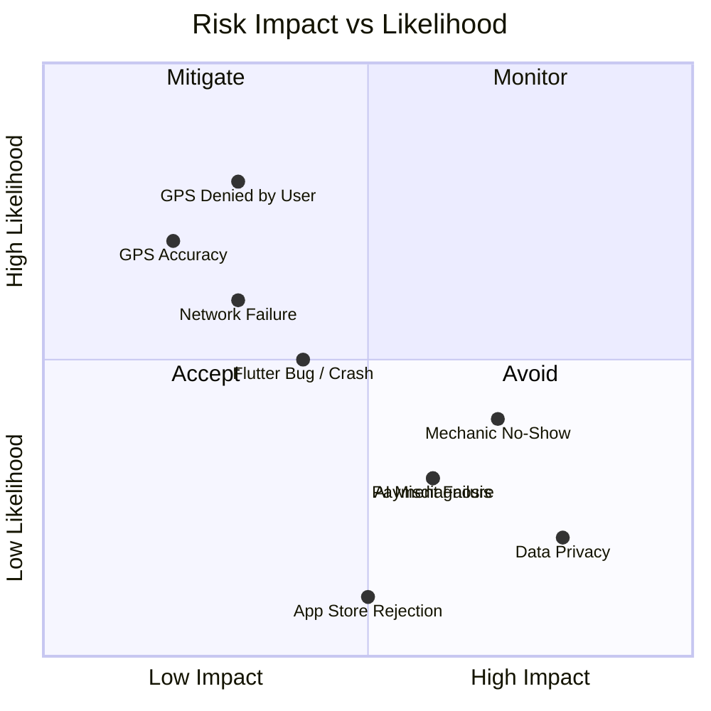

# Mecha Connect — Risk Analysis

**Version:** 1.0  
**Status:** Draft  
**Last Updated:** 2026-07-29  
**Owner:** Architecture Team  

---

## 1. Risk Matrix

---

## 2. Risk Register

| ID | Risk | Impact | Likelihood | Severity | Mitigation |
|----|------|--------|------------|----------|------------|
| R1 | GPS denied/GPS disabled | Medium | High | High | Graceful state machine, manual address entry fallback |
| R2 | Network failure during booking | High | Medium | High | Offline queue, retry logic, cached mechanic data |
| R3 | Mechanic no-show / cancel | High | Low | High | Penalty system, auto-reassign, user notification |
| R4 | AI misdiagnosis | Medium | Low | Medium | Confidence threshold < 60% → show disclaimer, human review option |
| R5 | Data privacy breach | High | Low | Medium | Firebase Security Rules, no PII stored locally, encryption |
| R6 | Flutter crash on low-end device | Medium | Medium | Medium | Responsive scaling, memory profiling, crashlytics monitoring |
| R7 | App Store / Play Store policy violation | High | Low | High | Review guidelines before each release, content filtering |
| R8 | Payment integration failure | High | Low | High | Idempotency keys, retry with exponential backoff |
| R9 | Location permission denied | Medium | High | Medium | Explain why location needed, show manual entry alternative |

---

## 3. Technical Debt Register

| ID | Item | Impact | Sprint Found | Remediation Plan |
|----|------|--------|-------------|------------------|
| TD1 | `lib/Starting_screen/` inconsistent naming | Low | 1.1 | Rename to `lib/features/splash/` in refactor sprint |
| TD2 | Legacy `mechanic_map_screen.dart` removed (Spring 1.6.3) | None | 1.6.3 | ✅ Done |
| TD3 | Mock data hardcoded | Medium | 1.4 | Replace with API calls in Sprint 2 |
| TD4 | No backend error handling in UI | Medium | 1.5 | Add error widgets in Sprint 2 |

---

## 4. Dependency Risks

| Dependency | Risk | Fallback |
|------------|------|----------|
| Gemini API | Rate limits, cost, downtime | Cached responses, keyword-based fallback |
| Firebase | Vendor lock-in, pricing | Abstract repository layer for migration |
| OpenStreetMap tiles | Tile server rate limits | Self-hosted tile server |
| Flutter 3.24+ | Version compatibility | Lock pubspec.yaml, CI matrix testing |

---

## 5. Related Documents

- [TEST_PLAN.md](../03_development/TEST_PLAN.md)
- [THIRD_PARTY_SERVICES.md](../archive/THIRD_PARTY_SERVICES.md)
- [PROJECT_STATUS.md](PROJECT_STATUS.md)

