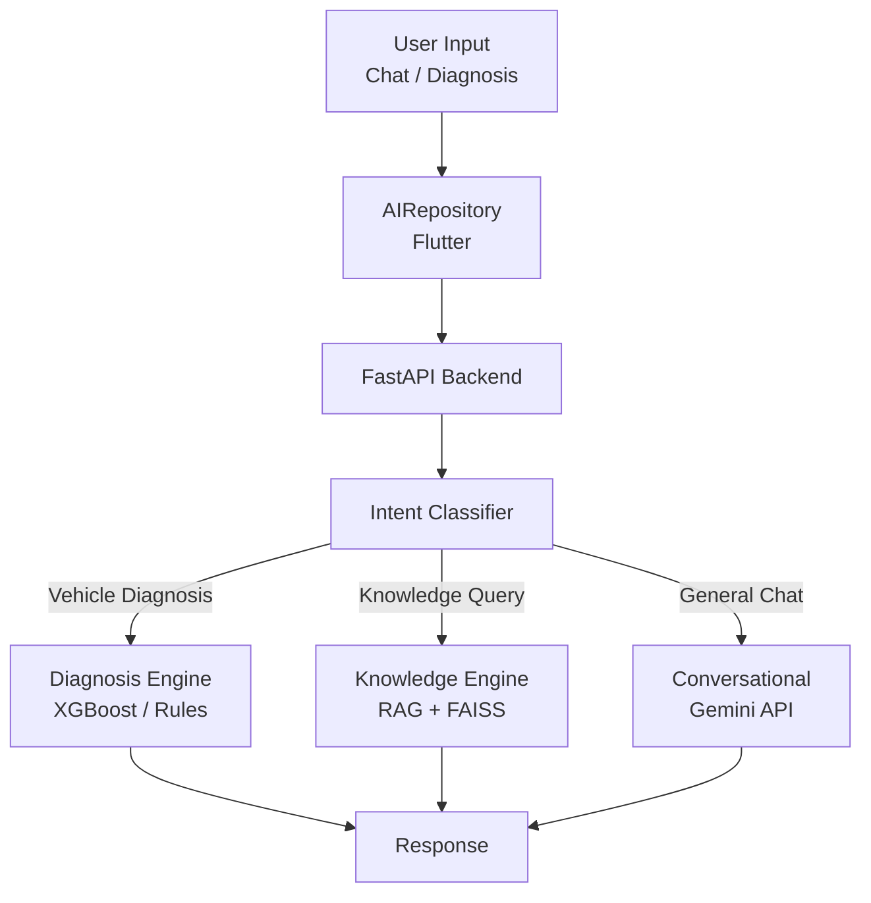

# Mecha Connect — AI Architecture

**Version:** 1.1.0  
**Status:** Partially Implemented (local inference)  
**Last Updated:** 2026-07-29  
**Owner:** AI Team  

---

## Table of Contents

1. [System Dataflow](#1-system-dataflow)
2. [Intent Classifier](#2-intent-classifier)
3. [Diagnosis Engine](#3-diagnosis-engine)
4. [Knowledge Engine (RAG)](#4-knowledge-engine-rag)
5. [Conversational Engine](#5-conversational-engine)
6. [Model Registry & Evaluation](#6-model-registry--evaluation)
7. [AI Roadmap](#7-ai-roadmap)
8. [Flutter Integration](#8-flutter-integration)
9. [Local Development](#9-local-development)
10. [Related Documents](#10-related-documents)

---

## System Dataflow



---

## 1. Intent Classifier

Inspects query text to determine the user's intent:

| Intent | Route | Engine |
|--------|-------|--------|
| Vehicle Diagnosis | `POST /api/v1/diagnosis/diagnose` | XGBoost + Rules |
| Repair Cost | `POST /api/v1/diagnosis/diagnose` | XGBoost + Rules |
| Dashboard Warning | `POST /api/v1/knowledge/query` | RAG (FAISS) |
| OBD Error Code | `POST /api/v1/knowledge/query` | RAG (FAISS) |
| Vehicle Maintenance | `POST /api/v1/knowledge/query` | RAG (FAISS) |
| General Question | `POST /api/v1/conversation/chat` | Gemini |

---

## 2. Diagnosis Engine

### Model: XGBoost Classifier
- **File:** `fault_classifier.joblib`
- **Training Data:** 1200+ simulated telemetry records
- **Features:** temperature, voltage, pressure, vibration, mileage, error codes
- **Output:** predicted fault, confidence score, estimated cost, repair time

### Rule-based Fallback
- Deterministic symptom matching when telemetry data is unavailable
- Maps user-described symptoms to known fault patterns

---

## 3. Knowledge Engine (RAG)

### Vector Store: FAISS
- **Embeddings:** `sentence-transformers/all-MiniLM-L6-v2` (HuggingFace)
- **Chunking:** LangChain text splitters on OEM PDF/text manuals
- **Retrieval:** Top-K similarity search (configurable `k`)

### Use Cases
- Dashboard warning light meanings
- OBD error code explanations
- Maintenance schedule lookup
- Repair procedure references

---

## 4. Conversational Engine

### Model: Gemini
- **Provider:** Google Generative AI
- **Model:** `gemini-2.5-flash`
- **Integration:** `langchain_google_genai` ChatGoogleGenerativeAI
- **Prompt:** System prompt as Senior Automotive Engineer

### Features
- Multi-turn conversation with session history
- Context-aware responses
- Safety advice generation

---

## 5. AI Roadmap

| Feature | Status |
|---------|--------|
| Vehicle Diagnosis (Symptom) | ✅ Live |
| Vehicle Diagnosis (Telemetry) | ✅ Model trained |
| RAG Knowledge Base | ✅ Live |
| Gemini Chat | ✅ Live |
| Voice Assistant | 🔲 Planned |
| Predictive Maintenance | 🔲 Planned |
| Smart Recommendations | 🔲 Planned |
| OCR / Image Analysis | 🔲 Planned |
| Chat History | 🔲 Planned |

---

## 8. Flutter Integration

### `lib/services/ai_repository.dart`
- Connects UI state to backend endpoints
- Methods: `createSession()`, `getHistory()`, `sendMessage()`, `diagnoseVehicle()`

### `lib/services/api_client.dart`
- Dynamic platform check (`kIsWeb`)
- Maps to `127.0.0.1` (browser/windows) or `10.0.2.2` (Android emulator)
- 30-second timeout for LLM calls

### `lib/bottom_bar/chatboard.dart`
- Material 3 chat interface
- Message list, quick chips, circular gauges, typing animations

### `lib/homescreen/mechanic_screen.dart`
- VehicleFormPage with AI diagnosis integration
- Shows diagnostic report bottom sheet with fault, cost, duration, safety advice

---

## 10. Related Documents

- [SYSTEM_ARCHITECTURE.md](SYSTEM_ARCHITECTURE.md)
- [API_SPEC.md](../06_reference/API_SPEC.md)
- [THIRD_PARTY_SERVICES.md](../06_reference/THIRD_PARTY_SERVICES.md)
- [FEATURE_SPECIFICATIONS.md](../01_product/FEATURE_SPECIFICATIONS.md)
- [RISK_ANALYSIS.md](../01_product/RISK_ANALYSIS.md)

---

## 11. Local Development
# Start FastAPI server
cd backend
uvicorn main:app --reload --port 8000

# API available at:
# http://127.0.0.1:8000/docs  (Swagger UI)
# http://127.0.0.1:8000/redoc (ReDoc)
```

