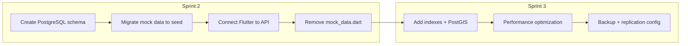

# Mecha Connect — Database Schema

**Version:** 1.1.0  
**Status:** Draft (Sprint 2 implementation)  
**Last Updated:** 2026-07-29  
**Owner:** Architecture Team  

---

## Table of Contents

1. [Entity Relationship](#entity-relationship)
2. [Core Tables (PostgreSQL)](#core-tables-postgresql)
3. [Real-time Collections (Firestore)](#real-time-collections-firestore)
4. [Index Strategy](#index-strategy)
5. [Migration Plan](#migration-plan)
6. [Current Status](#current-status)
7. [Related Documents](#related-documents)

---

## Entity Relationship

```
Users ──── Vehicles
  │            │
  ├──── Bookings ──── Mechanics
  │       │
  │       └──── Invoices
  │
  ├──── Orders ──── Products
  │       │
  │       └──── Payments
  │
  └──── Reviews
```

---

## Core Tables (PostgreSQL)

### Users
| Column | Type | Notes |
|--------|------|-------|
| id | UUID | PK |
| name | VARCHAR(100) | |
| email | VARCHAR(255) | Unique |
| phone | VARCHAR(20) | Unique |
| password_hash | VARCHAR(255) | |
| avatar_url | TEXT | |
| address | TEXT | |
| location | GEOGRAPHY(Point) | PostGIS |
| role | ENUM | customer, partner, admin |
| created_at | TIMESTAMP | |
| updated_at | TIMESTAMP | |

### Vehicles
| Column | Type | Notes |
|--------|------|-------|
| id | UUID | PK |
| user_id | UUID | FK → users |
| brand | VARCHAR(50) | |
| model | VARCHAR(100) | |
| year | INTEGER | |
| plate_number | VARCHAR(20) | |
| type | ENUM | bike, car, truck, van |
| created_at | TIMESTAMP | |

### Mechanics
| Column | Type | Notes |
|--------|------|-------|
| id | UUID | PK |
| name | VARCHAR(100) | |
| phone | VARCHAR(20) | |
| email | VARCHAR(255) | |
| location | GEOGRAPHY(Point) | PostGIS |
| rating | DECIMAL(2,1) | |
| review_count | INTEGER | |
| experience_years | INTEGER | |
| is_verified | BOOLEAN | |
| is_available | BOOLEAN | |
| price_starting | DECIMAL(10,2) | |
| skills | TEXT[] | |
| languages | TEXT[] | |
| about | TEXT | |
| working_hours | JSONB | |
| created_at | TIMESTAMP | |

### Services
| Column | Type | Notes |
|--------|------|-------|
| id | UUID | PK |
| mechanic_id | UUID | FK → mechanics |
| name | VARCHAR(100) | |
| description | TEXT | |
| price | DECIMAL(10,2) | |
| estimated_minutes | INTEGER | |
| is_active | BOOLEAN | |

### Bookings
| Column | Type | Notes |
|--------|------|-------|
| id | UUID | PK |
| user_id | UUID | FK → users |
| mechanic_id | UUID | FK → mechanics |
| vehicle_id | UUID | FK → vehicles |
| service_id | UUID | FK → services |
| status | ENUM | pending, confirmed, in_progress, completed, cancelled |
| address | TEXT | |
| location | GEOGRAPHY(Point) | |
| estimated_cost | DECIMAL(10,2) | |
| final_cost | DECIMAL(10,2) | |
| estimated_arrival | TIMESTAMP | |
| started_at | TIMESTAMP | |
| completed_at | TIMESTAMP | |
| created_at | TIMESTAMP | |

### Invoices
| Column | Type | Notes |
|--------|------|-------|
| id | UUID | PK |
| booking_id | UUID | FK → bookings |
| user_id | UUID | FK → users |
| amount | DECIMAL(10,2) | |
| status | ENUM | pending, paid |
| payment_method | VARCHAR(50) | |
| paid_at | TIMESTAMP | |
| created_at | TIMESTAMP | |

### Reviews
| Column | Type | Notes |
|--------|------|-------|
| id | UUID | PK |
| booking_id | UUID | FK → bookings (unique) |
| user_id | UUID | FK → users |
| mechanic_id | UUID | FK → mechanics |
| rating | INTEGER | 1–5 |
| comment | TEXT | |
| created_at | TIMESTAMP | |

### Fuel Orders
| Column | Type | Notes |
|--------|------|-------|
| id | UUID | PK |
| user_id | UUID | FK → users |
| fuel_type | ENUM | petrol, diesel |
| quantity | DECIMAL(5,2) | litres |
| location | GEOGRAPHY(Point) | |
| status | ENUM | requested, accepted, delivered, cancelled |
| total_cost | DECIMAL(10,2) | |
| partner_id | UUID | FK → fuel_partners |
| created_at | TIMESTAMP | |

### Products (Marketplace)
| Column | Type | Notes |
|--------|------|-------|
| id | UUID | PK |
| name | VARCHAR(200) | |
| description | TEXT | |
| price | DECIMAL(10,2) | |
| category | VARCHAR(50) | |
| stock | INTEGER | |
| image_url | TEXT | |
| seller_id | UUID | FK → sellers |
| created_at | TIMESTAMP | |

---

## Real-time Collections (Firestore)

### `chats/{chatId}`
- `booking_id` (string)
- `participants` [user_id, mechanic_id]
- `last_message` (string)
- `last_message_at` (timestamp)
- `messages` subcollection

### `tracking/{bookingId}`
- `mechanic_location` (GeoPoint)
- `status` (string)
- `eta_minutes` (number)
- `updated_at` (timestamp)

---

## Current Status

All data is currently served from **mock data** in `lib/mechanic/mock_data.dart`. Database migration is planned for Sprint 2.

---

## Index Strategy

| Table | Index | Type | Purpose |
|-------|-------|------|---------|
| Mechanics | location | GIST (PostGIS) | Nearby mechanic queries |
| Mechanics | is_available | B-tree | Filter active mechanics |
| Bookings | user_id | B-tree | User booking history |
| Bookings | mechanic_id | B-tree | Mechanic booking list |
| Bookings | status | B-tree | Status-based filtering |
| Reviews | mechanic_id | B-tree | Rating aggregation |
| Vehicles | user_id | B-tree | User vehicle list |

---

## Migration Plan



---

## Related Documents

- [SYSTEM_ARCHITECTURE.md](SYSTEM_ARCHITECTURE.md)
- [API_SPEC.md](../06_reference/API_SPEC.md)
- [DEPLOYMENT.md](../03_development/DEPLOYMENT.md) (migration commands)

