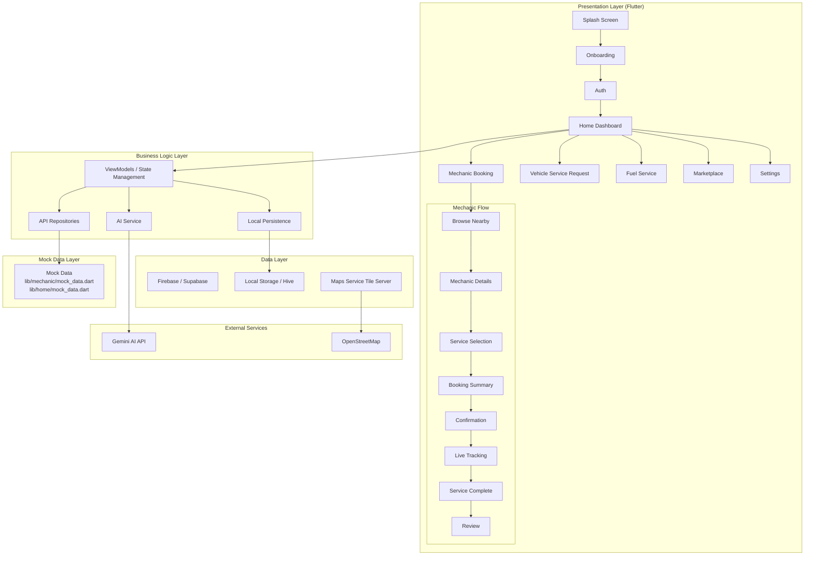
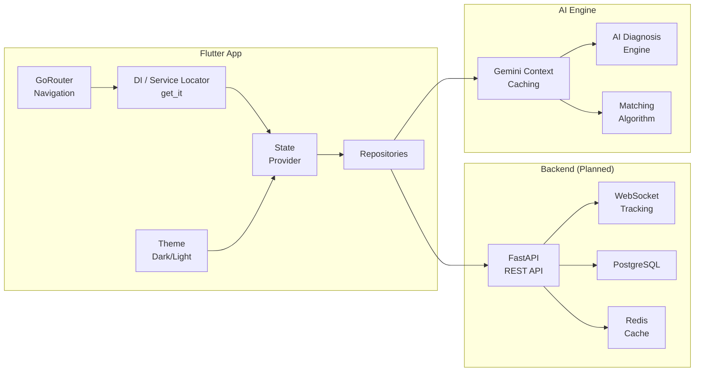
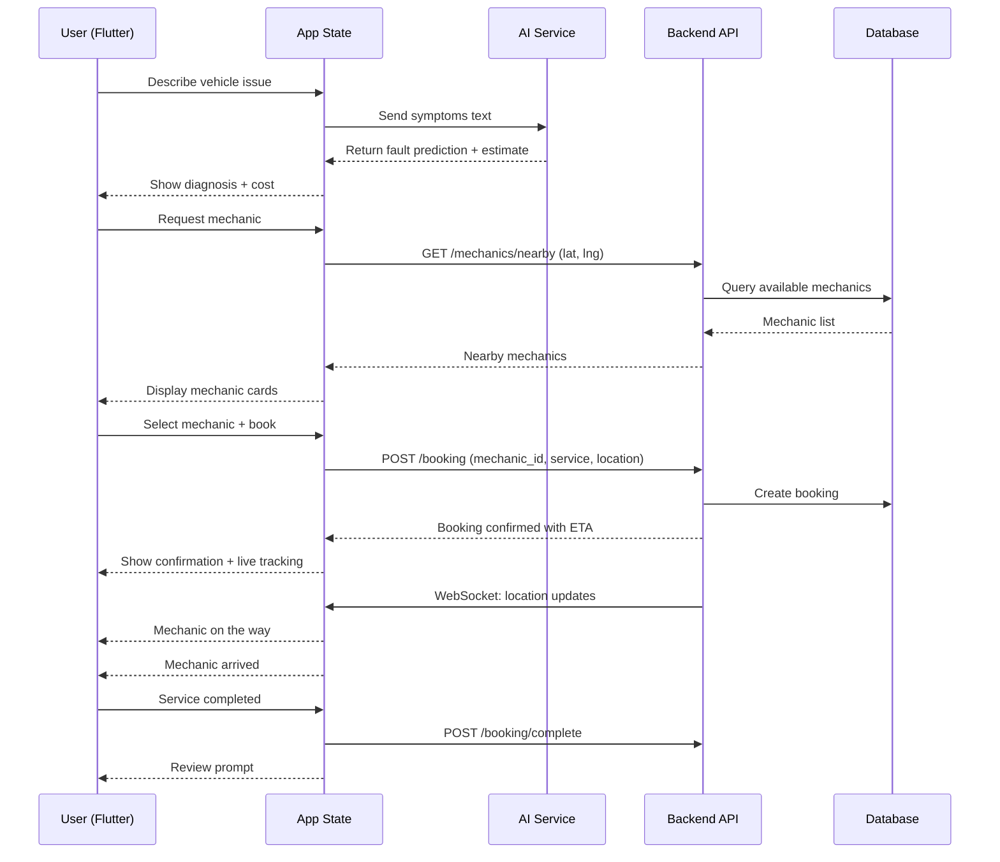
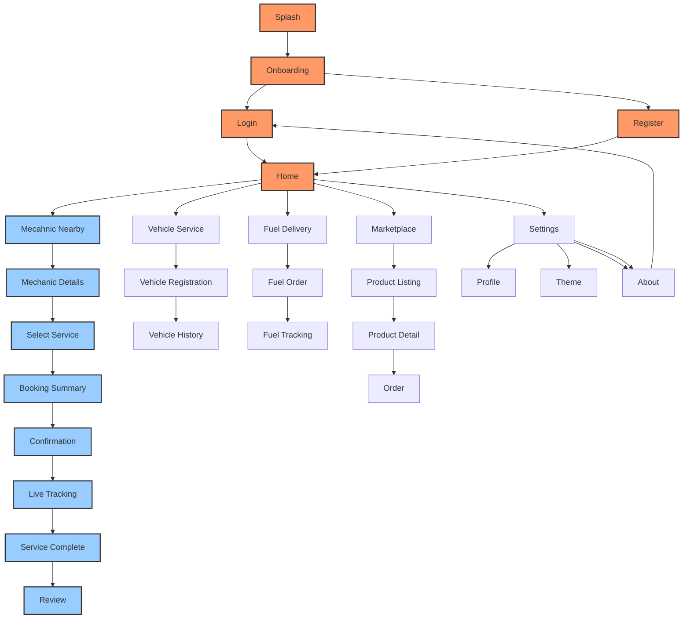
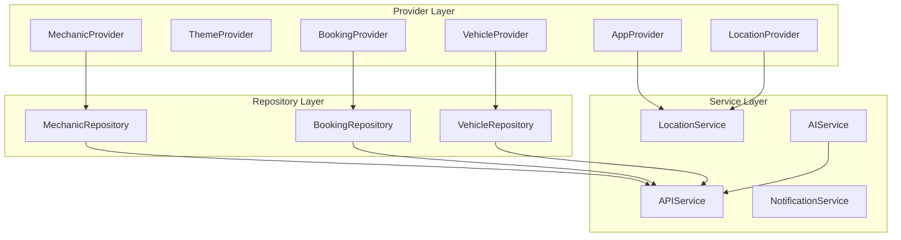

# Mecha Connect — System Architecture

**Version:** 1.0  
**Status:** Locked  
**Last Updated:** 2026-07-29  
**Owner:** Architecture Team  

---

## 1. Architecture Overview



---

## 2. Component Architecture



---

## 3. Data Flow: Mechanic Booking



---

## 4. Navigation Architecture



---

## 5. State Management Architecture



---

## 6. Directory Structure

```
lib/
├── main.dart
├── auth/
├── home/
│   └── widgets/
├── mechanic/
│   ├── screens/
│   └── widgets/
├── homescreen/
├── bottom_bar/
├── Starting_screen/
├── parts/
├── theme/
├── widgets/
├── services/
└── test/
```

---

## 7. Related Documents

- [PROJECT_ARCHITECTURE.md](PROJECT_ARCHITECTURE.md)
- [DATABASE_SCHEMA.md](DATABASE_SCHEMA.md)
- [API_SPEC.md](../06_reference/API_SPEC.md)
- [AI_ARCHITECTURE.md](AI_ARCHITECTURE.md)
- [DEPLOYMENT.md](../03_development/DEPLOYMENT.md)

