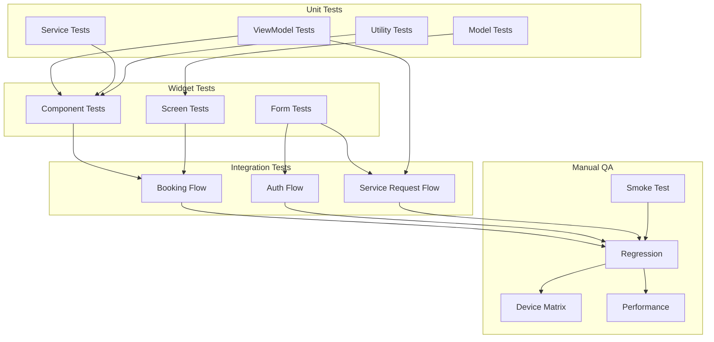

# Mecha Connect — Test Plan

**Version:** 1.0  
**Status:** Draft  
**Last Updated:** 2026-07-29  
**Owner:** QA Team  

---

## 1. Testing Strategy

---

## 2. Test Coverage Targets

| Layer | Target | Current |
|-------|--------|---------|
| ViewModels | 90% | In progress |
| Services | 85% | In progress |
| Widgets (Screens) | 70% | In progress |
| Integration (Booking Flow) | 100% (critical path) | In progress |
| Manual & Regression | Per sprint release | Ongoing |

---

## 3. Test Categories

### 3.1 Unit Tests
| Area | What to Test | Priority |
|------|-------------|----------|
| ViewModels | State transitions, loading/error/success | High |
| AI Service | Symptom parsing, prediction parsing | High |
| Location Service | State machine (loading, denied, ready) | High |
| Booking Logic | Price calculation, ETA formatting | Medium |
| Vehicle Model | Validation rules, toMap/fromMap | Medium |

### 3.2 Widget Tests
| Screen | Key Tests | Priority |
|--------|-----------|----------|
| Splash | Animation plays, transitions to onboarding/auth | Medium |
| Mechanic Card | Renders compact/full, no overflow, tap callback | High |
| Live Tracking | Map renders, ETA displays, complete button works | High |
| Booking Summary | Total calculation, item display, confirm button | High |
| Vehicle Form | Validation errors, camera/gallery actions | Medium |

### 3.3 Integration Tests
| Flow | Scenario | Priority |
|------|----------|----------|
| Full Booking | Browse → Details → Select → Summary → Confirm → Track → Complete → Review | Critical |
| Auth | Login → Home → Logout → Login again | High |
| Vehicle Service | Register vehicle → View history | Medium |

---

## 4. Test Environments

| Environment | Purpose | Build Type |
|-------------|---------|------------|
| Local dev | Unit + widget tests | flutter test |
| CI (GitHub Actions) | Pre-merge validation | dart analyze + flutter test |
| Internal Test | Device matrix + smoke test | flutter build apk --debug |
| QA Release | Full regression | flutter build apk --release |

---

## 5. Test Data

All tests use mock data located at:
- `lib/mechanic/mock_data/mock_data.dart`
- `lib/vehicle/mock_data/`

---

## 6. Acceptance Criteria

Each user story **must** pass:
- dart analyze — 0 errors
- Widget tests for that screen — passing
- No crash on hot reload
- Responsive layout verified on small (360px) and large (600px+) screens
- Dark mode renders correctly

---

## 7. Related Documents

- [PROJECT_STATUS.md](../01_product/PROJECT_STATUS.md)
- [FEATURE_SPECIFICATIONS.md](../01_product/FEATURE_SPECIFICATIONS.md)
- [CONTRIBUTING.md](CONTRIBUTING.md)

