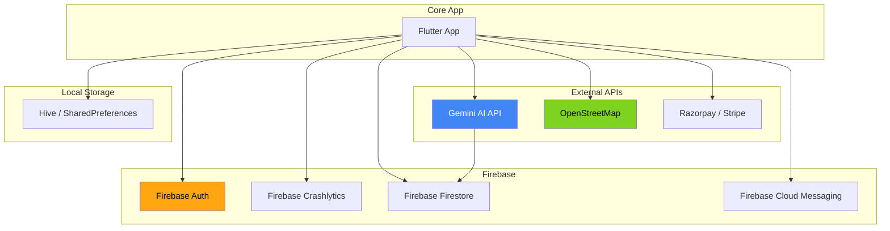

# Mecha Connect — Third-Party Services

**Version:** 1.0  
**Status:** Draft  
**Last Updated:** 2026-07-29  
**Owner:** Architecture Team  

---

## 1. Service Inventory

| Service | Purpose | Integration | Status | Cost | Fallback |
|---------|---------|-------------|--------|------|----------|
| **Gemini API** | AI diagnosis from symptoms | HTTP via `lib/core/services/ai_service.dart` | ✅ Active | ₹5,000/month (projected) | Regex keyword matching + cached responses |
| **Firebase (Auth)** | Email/Google sign-in | FlutterFire SDK | ✅ Active | Free tier | Custom JWT (Sprint 3) |
| **Firebase (Crashlytics)** | Error monitoring | FlutterFire SDK | ✅ Active | Free tier | Sentry (backup) |
| **OpenStreetMap** | Map tiles for mechanic tracking | flutter_map plugin (tile URL) | ✅ Active | Free | Mapbox (paid, Sprint 2) |
| **Hive / SharedPrefs** | Local persistence | Direct package dependency | ✅ Active | Free | sqflite (if complex queries needed) |
| **Firebase Cloud Messaging** | Push notifications | FlutterFire SDK | 🔲 Planned | Free tier | OneSignal (Sprint 3) |
| **Razorpay / Stripe** | Payment processing | HTTP API | 🔲 Planned (Sprint 2) | 2% per tx | Cash on delivery |

---

## 2. API Keys & Secrets

| Secret | Storage Location | Rotation | Access |
|--------|-----------------|----------|--------|
| GEMINI_API_KEY | secrets.properties (gitignored) | Quarterly | Dev team |
| Firebase config | google-services.json (gitignored) | Per project | Dev + CI |
| Map tile URL | .env (gitignored) | Rarely | Dev team |

⚠️ **All secrets are gitignored.** See `.gitignore`.

---

## 3. Rate Limits & Quotas

| Service | Limit | Mitigation |
|---------|-------|------------|
| Gemini API | 60 RPM (free) | Queue requests, cache common diagnoses |
| OpenStreetMap tiles | 10,000/day (standard) | Local tile caching |
| Firebase Auth | 1,000 sign-ups/hour (free) | Phone auth as backup |

---

## 4. Security Considerations

- Firebase Security Rules restrict read/write to authenticated users
- No PII stored in Hive/SharedPreferences
- Gemini API calls include sanitized symptoms (no PII in prompt)
- HTTPS enforced on all external calls

---

## 5. Service Dependency Graph

---

## 6. Related Documents

- [AI_ARCHITECTURE.md](../02_architecture/AI_ARCHITECTURE.md)
- [API_SPEC.md](API_SPEC.md)
- [DEPLOYMENT.md](../03_development/DEPLOYMENT.md)
- [RISK_ANALYSIS.md](../01_product/RISK_ANALYSIS.md)

