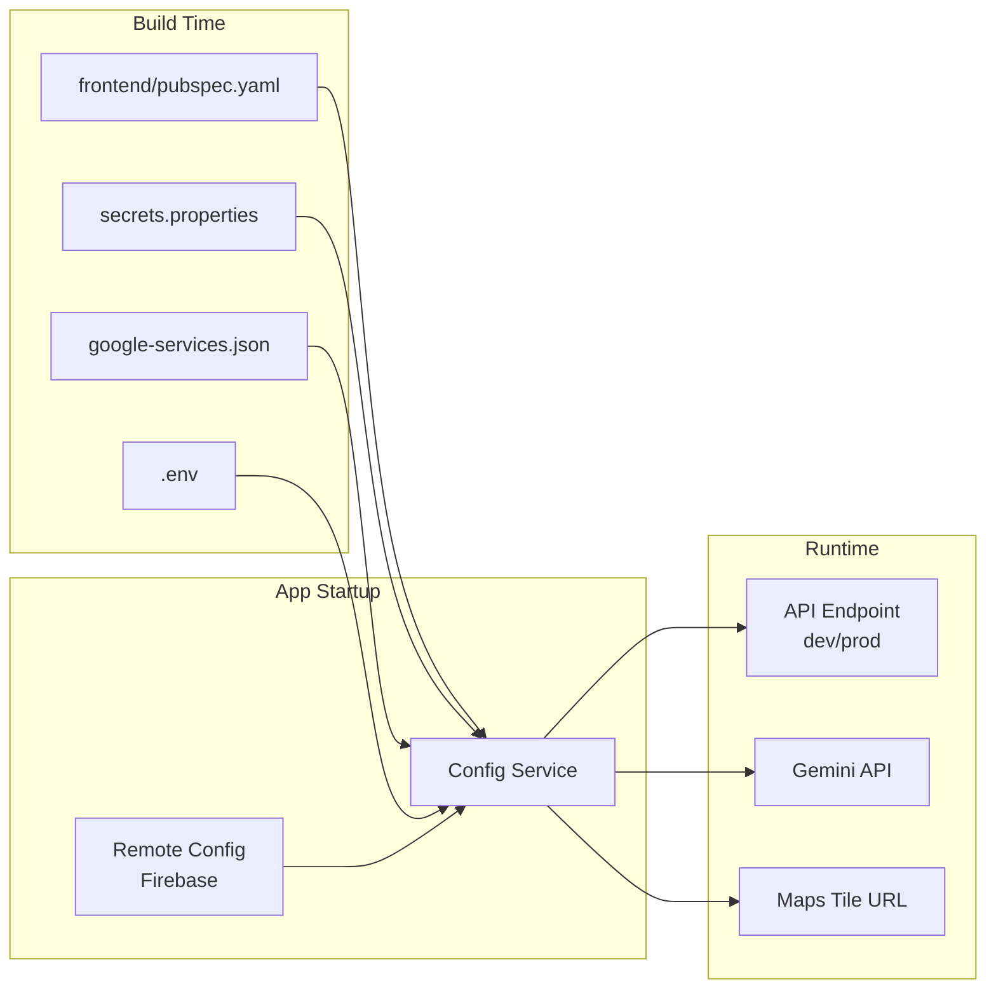
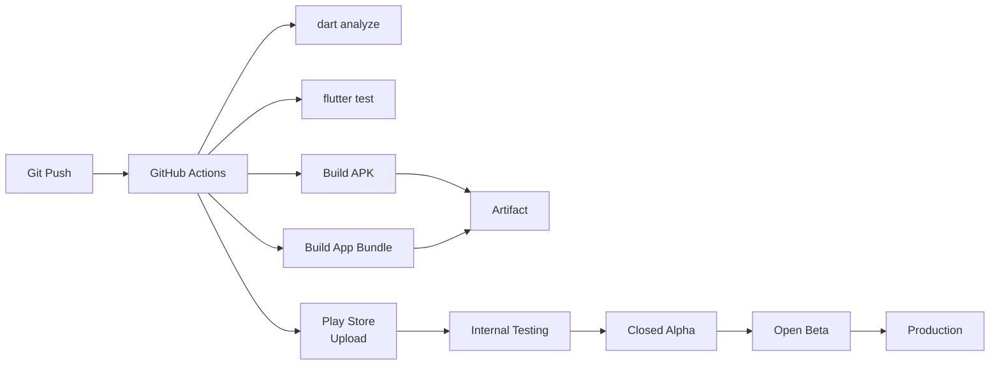

# Mecha Connect — Deployment Guide

**Version:** 1.0  
**Status:** Draft  
**Last Updated:** 2026-07-29  
**Owner:** DevOps Team  

---

## 1. Build Requirements

### Environment
- **Flutter SDK:** >=3.24.0 <4.0.0
- **Dart SDK:** >=3.5.0
- **Android:** minSdkVersion 21, targetSdkVersion 34
- **iOS:** (Future, not yet configured)
- **Build Tool:** flutter build apk / appbundle

### Config Values (Required at Build Time)
| Key | Source | Default |
|-----|--------|---------|
| GEMINI_API_KEY | secrets.properties | — |
| FIREBASE_API_KEY | google-services.json | — |
| FIREBASE_PROJECT_ID | google-services.json | — |
| MAP_TILE_URL | .env | OpenStreetMap default |

---

## 2. Build Commands

```bash
# Run from the frontend/ directory
cd frontend

# Development
flutter run --debug

# Production APK
flutter build apk --release

# Production App Bundle (Play Store)
flutter build appbundle --release

# Analyze for errors
dart analyze

# Run tests
flutter test
```

---

## 3. Release Checklist

| Step | Description | Status |
|------|-------------|--------|
| 1 | dart analyze — 0 errors | ✅ |
| 2 | flutter test — all passing | ✅ |
| 3 | Version bump (frontend/pubspec.yaml) | 🔲 |
| 4 | Update CHANGELOG.md | 🔲 |
| 5 | Build APK (--release) | 🔲 |
| 6 | Smoke test on physical device | 🔲 |
| 7 | Upload to Play Store Console | 🔲 |

---

## 4. Environment Configuration



---

## 5. CI/CD (Planned)



---

## 6. Version Strategy

| Channel | Version Suffix | Frequency |
|---------|---------------|-----------|
| Development | dev-{commit_hash} | Per commit |
| Internal Test | alpha-{build_number} | Daily |
| Closed Alpha | beta-{build_number} | Weekly |
| Open Beta | rc-{build_number} | Bi-weekly |
| Production | {major}.{minor}.{patch} | Monthly |

---

## 7. Related Documents

- [Architecture.md](../frontend/Architecture.md)
- [Testing.md](../frontend/Testing.md)
- [CONTRIBUTING.md](../common/CONTRIBUTING.md)

