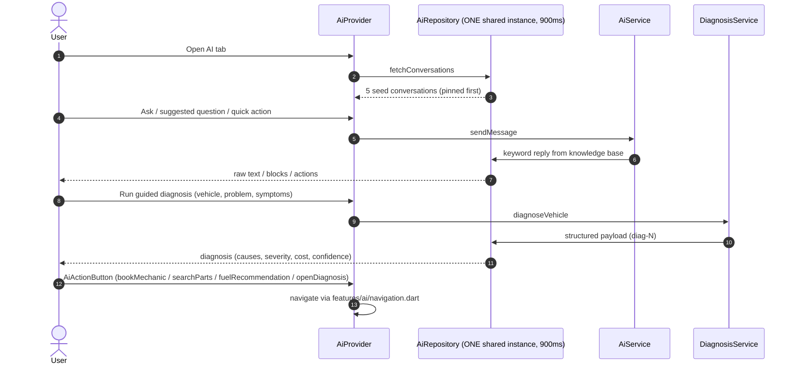

# Workflow: AI Diagnosis & Assistant

> Modules: ai · mechanic/fuel/marketplace (cross-module actions)

## Mermaid

## Narrative
1. AI tab is tab 3; `AiHomeScreen` shows suggested questions, quick actions, history.
2. Chat (keyword engine, not generative at RC1) returns `AiResponse` with typed blocks
   (text | warning | recommendation | bulletList | checklist | costEstimate).
3. Diagnosis structured payload: symptoms → possible causes → severity → estimated cost →
   recommended action/service + confidence; mechanic VehicleForm reuses `DiagnosisService`.
4. Action buttons deep-link to Mechanic/Fuel/Marketplace.
5. History: rename/delete via bottom sheet; conversations survive refresh (`_mergeReloaded`).

## Decision / Failure / Recovery
- **Triple-repo bug (fixed 1.9b):** Provider + AiService + DiagnosisService share ONE `AiRepository`.
- **Refresh:** pull-to-refresh merges, preserving user conversations + pin overrides.
- **Failure injection:** `failForFirstCalls` → `AiNetworkException` with retry UI.
- **Misdiagnosis (risk R4):** confidence < 60% → disclaimer + human review option (product-level).

## Backend Notes (Sprint 2)
- Scaffold mirrors this surface: `api/v1/conversation.py`, `diagnosis.py`, `knowledge.py`.
- `chat_service` (Gemini/langchain), `diagnosis_service` (XGBoost `fault_classifier.joblib`),
  `rag_service` (FAISS KB: faq, manuals, obd_codes, dashboard_symbols).
- Tables: `conversations`, `chat_messages` (response JSONB), `diagnoses`.
