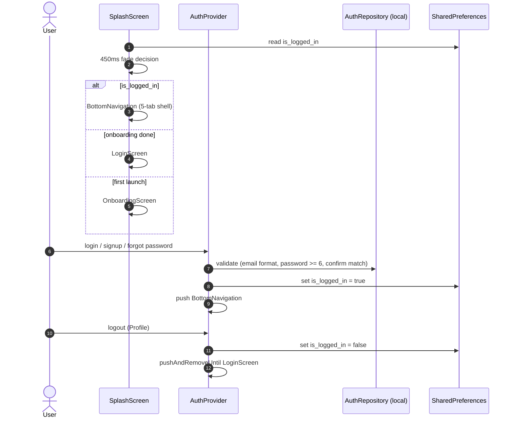

# Workflow: Auth & Session

> Modules: auth · splash/onboarding (starting_screen)

## Mermaid

## Narrative
1. Auth screens: Login / SignUp / ForgotPassword, linked to each other.
2. Google Sign-In is in the spec; at RC1 auth is local-only (SharedPreferences `is_logged_in`).
3. Splash route decision is the only entry gate; no dev flags remain.

## Decision / Failure / Recovery
- **Validation errors:** email format, password length ≥ 6, confirm-match.
- **Not authenticated:** session flag false → login screen after onboarding.
- **Logout:** confirm dialog → `pushAndRemoveUntil(LoginScreen)` — the only reverse path.

## Backend Notes (Sprint 2)
- Firebase Auth + JWT; `users.password_hash`; credentials never stored at RC1.
- `is_logged_in` remains an on-device flag for splash routing.
