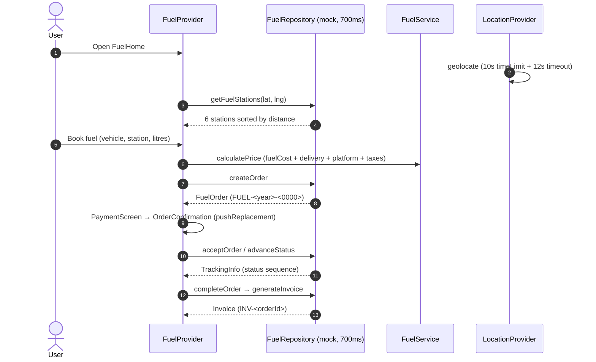

# Workflow: Fuel Delivery Lifecycle

> Modules: fuel_delivery · location (LocationProvider/GeocodingService)

## Mermaid

## Narrative
1. Entry: Services tab → Fuel card → `FuelHomeScreen`.
2. Location: GPS acquisition capped (10s settings timeLimit, 12s `.timeout`) — fixes the
   Sprint 1.7A blank-screen bug on GPS-less devices; "Set Manually" fallback (Bengaluru default coords).
3. Pick vehicle (3 saved), fuel type (petrol/diesel/premiumPetrol; electric/cng coming-soon disabled),
   station (6 sorted by distance, availability shown), quantity (min/max from `fuel_constants.dart`).
4. `FuelService.calculatePrice`: `grandTotal = fuelCost + deliveryCharge + platformFee + taxes`.
5. Pay → confirm → live tracking through the status sequence.
6. Complete → invoice receipt.
7. History seeded `FUEL-2026-0005..0009`.

## Decision / Failure / Recovery
- **GPS unavailable / denied:** "unavailable" state with manual-address fallback (risk R1/R9).
- **Station out of stock:** `availability=outOfStock` → selection blocked or warning.
- **Order cancel:** `cancelOrder(id)` → status cancelled.
- **Error/retry:** typed `FuelNetworkException` via `failForFirstCalls`.
- **Timer perf:** whole-screen 1s timer isolated in `_ElapsedTimerText` (map never rebuilds on ticks).

## Backend Notes (Sprint 2)
- `fuel_orders` + `price_estimates` (1-1) + `tracking_events` + `invoices`.
- Live tracking via WebSocket push; station distance/ETA computed server-side.
