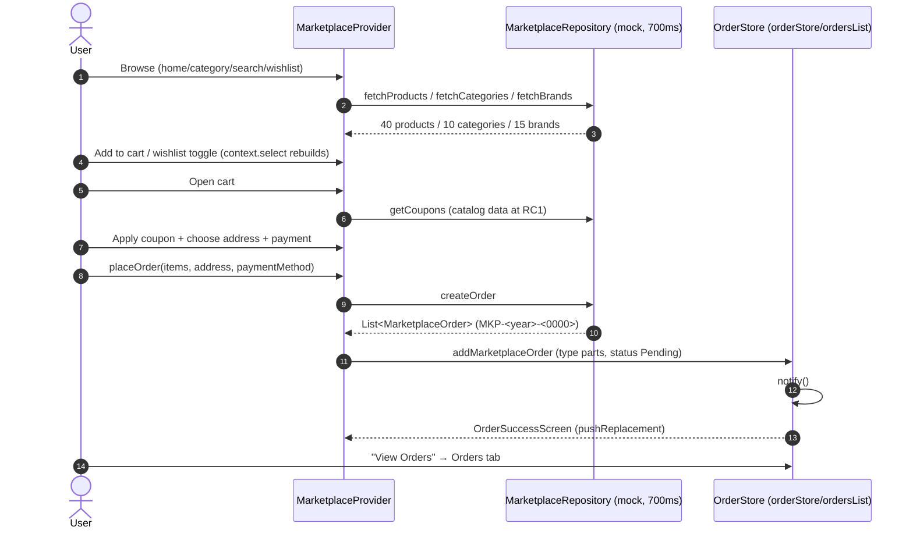

# Workflow: Marketplace Checkout

> Modules: marketplace · orders (OrderStore) · profile (order history)

## Mermaid

## Narrative
1. Browse catalog (featured/best-seller/trending/flash-deal/recommended flags).
2. Product detail: specs, reviews, compatibility, vehicle types, wishlist/cart (44px + tooltips).
3. Cart → checkout (address, payment, coupon; MECHA10/MECHA20).
4. `placeOrder` returns typed orders for the confirmation flow and writes the Orders tab.
5. `OrderSuccessScreen` replaces the stack; "View Orders" jumps to tab 2.

## Decision / Failure / Recovery
- **Out of stock** (`p-out-of-stock` seed): buy disabled.
- **Empty cart / wishlist:** empty-state illustrations.
- **Error/retry:** typed `MarketplaceNetworkException`.
- **Coupon:** catalog data at RC1; **server-validated in Sprint 2**.
- **Redundant rebuild:** product card uses `context.read` + `context.select` (wishlist only).

## Backend Notes (Sprint 2)
- `orders` (parent) + `order_items`; Marketplace inserts write `order_entries` (unified feed).
- Coupons server-validated (`coupons` table, valid_from/until, max_discount, min_order_value).
- Order IDs `MKP-<year>-<0000>` = `orders.external_id`.
