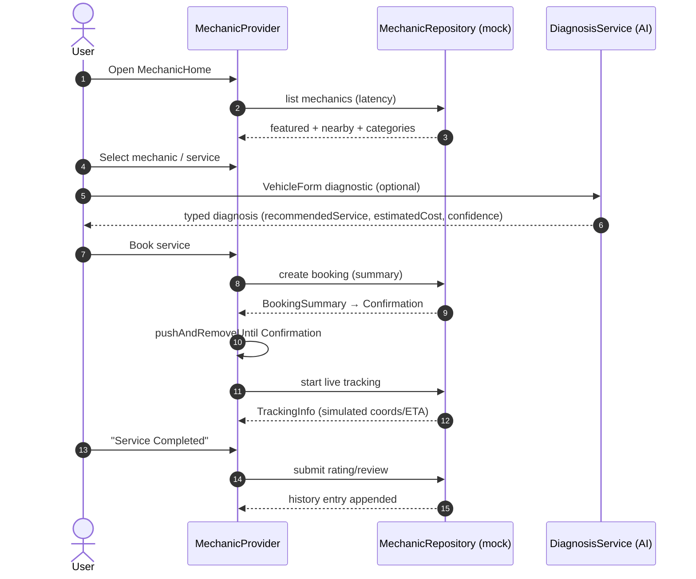

# Workflow: Mechanic Booking Lifecycle

> Modules: mechanic · ai (VehicleForm diagnosis) · profile

## Mermaid

## Narrative
1. Entry: Services tab → Mechanic card → `VehicleFormPage` → `MechanicHomeScreen` (requires a valid vehicle form).
2. Browse: nearby mechanics with distance, service categories, booking history.
3. Detail: `MechanicDetailsScreen` (rating, services, availability, working hours, reviews).
4. Select service → optional AI diagnosis (mock, no HTTP) informs the booking.
5. Summary → confirm (`pushAndRemoveUntil` clears the stack) → confirmation with ETA + mechanic info.
6. Live tracking: map with mechanic marker (3s `_ProgressTimeline` timer, map not rebuilt on ticks).
7. Complete → rating + review (`RatingReviewScreen`).
8. Booking history grows in `BookingHistoryScreen`.

## Decision / Failure / Recovery
- **Mechanic unavailable** (`m4` seed): `is_available=false` → card disabled, no booking path.
- **Loading:** skeleton loaders for Featured + Nearby.
- **Error:** retry button with message (typed `MechanicNetworkException` via `failForFirstCalls`).
- **Empty:** "No mechanics found" illustration.
- **Location denied:** permission request dialog; **GPS disabled:** settings redirect prompt.
- **No-show (risk R3):** penalty + auto-reassign + user notification (product-level, Sprint 2).

## Backend Notes (Sprint 2)
- Endpoints mirror repo methods; bookings → `mechanic_bookings` + `booking_events` (JSONB payloads) + `ratings`.
- Live tracking → `tracking_events` + WebSocket push; `TrackingInfo` payload frozen.
- Distance/ETA computed server-side at request time.
