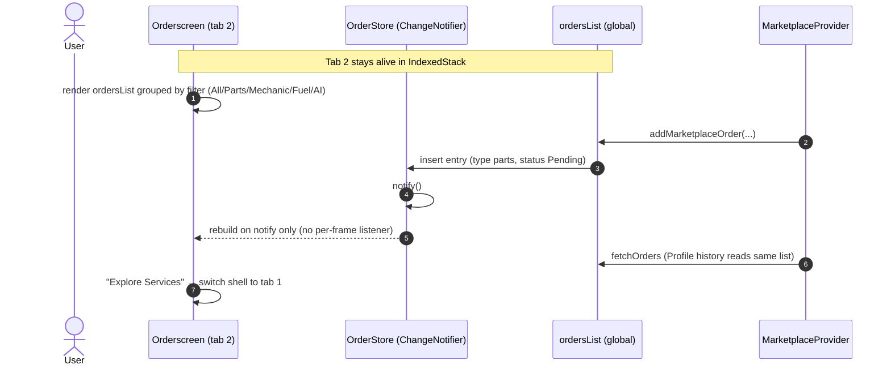

# Workflow: Orders Tab (Unified Feed)

> Modules: orders (tab 2) · marketplace · profile · orderStore/ordersList

## Mermaid

## Narrative
1. Orders tab renders the shared global `ordersList`, grouped by category filter tabs.
2. Marketplace checkout inserts `parts` entries and notifies via `OrderStore`.
3. Profile order history reads the same list — single source, never diverges.
4. Seeded entries exist for Parts / Mechanic / Fuel / AI categories.

## Decision / Failure / Recovery
- **Stale tab:** fixed in 1.9b — tab rebuilds only on tab change or `OrderStore.notify()`.
- **Offstage duplicates:** hidden tab labels stay in the tree (tests use `.first`).
- **Empty:** empty-state for a category with no entries.

## Backend Notes (Sprint 2)
- `ordersList` ↔ `order_entries` table; type parts|mechanic|fuel|aiReport;
  status Pending|Delivered|Completed|In Progress|Cancelled.
- Marketplace inserts write here; Orders tab + Profile history read the same rows.
