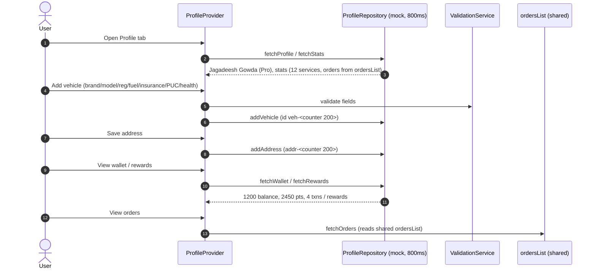

# Workflow: Profile & Vehicle Management

> Modules: profile · orders (shared list)

## Mermaid

## Narrative
1. Profile tab = tab 4; header, vehicles, wallet, rewards, orders, addresses, notifications,
   privacy, support, about, theme picker, logout.
2. Vehicles/addresses sort default-first (frozen ordering), counters start at 200.
3. `ProfileStats.orders` comes from the shared `ordersList` — never diverges from Orders tab.
4. Notification settings persist via `NotificationSettingsStore`
   (SharedPreferences prod / in-memory tests).

## Decision / Failure / Recovery
- **Validation:** `ValidationService` guards address/vehicle/payment fields.
- **Default promotion:** `setDefaultVehicle/Address` auto-promotes (one default).
- **Error/retry:** typed `ProfileNetworkException` via `failForFirstCalls`.
- **Delete:** vehicle/address delete confirmed in UI.

## Backend Notes (Sprint 2)
- `users`, `vehicles`, `addresses`, `wallet`, `wallet_transactions`, `reward_ledger`, `notification_settings`.
- `ProfileStats.orders = count(order_entries)`; rewards = `sum(reward_ledger.points)`.
- `is_logged_in` + `theme_mode` stay on-device (SharedPreferences), never in DB.
